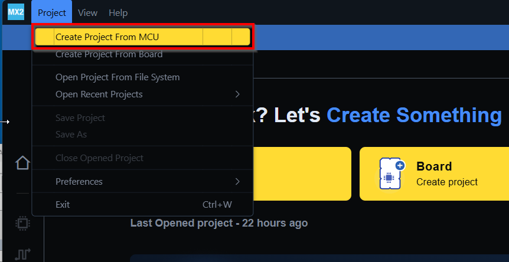
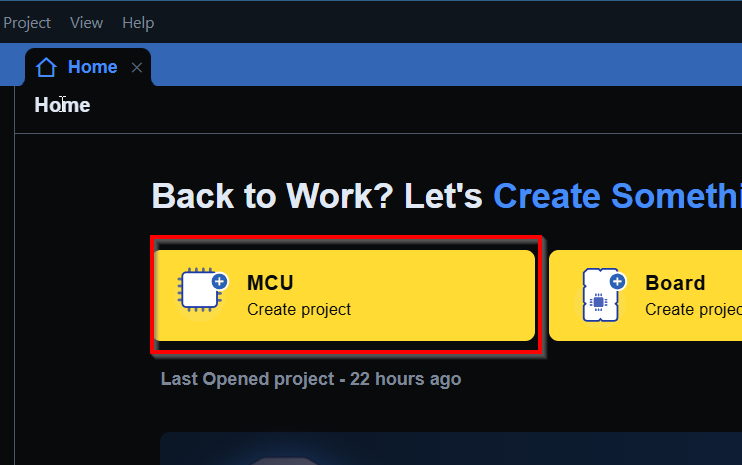
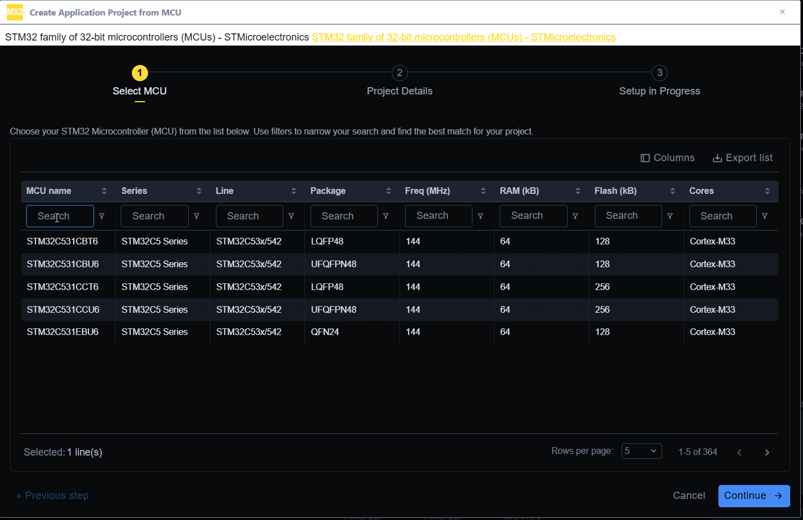
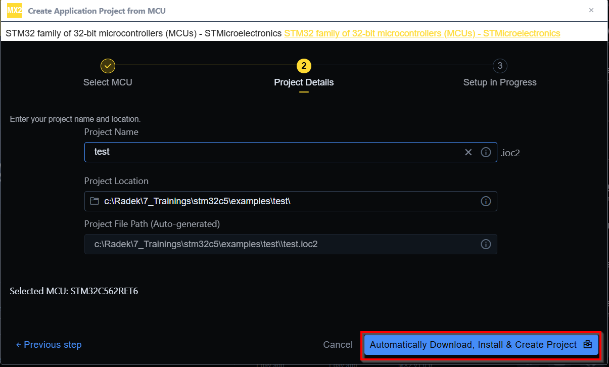
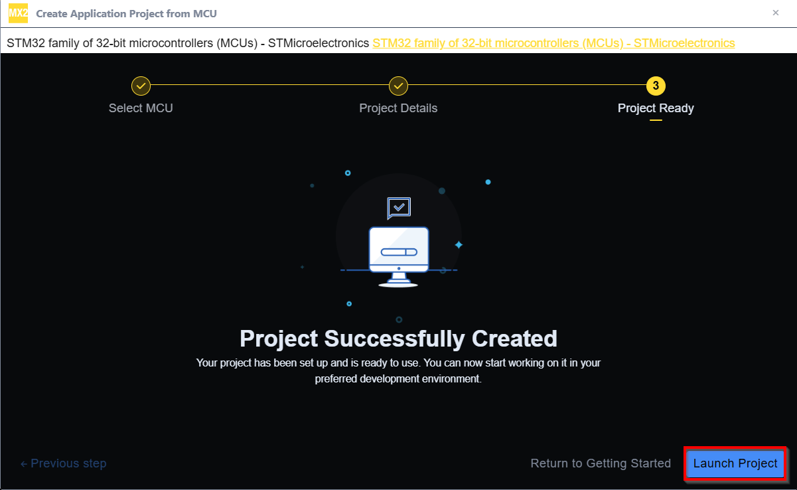

# Create new project in STM32CubeMX2

How to create new project: 

1. Start STM32CubeMX2
2. Create new project
  - Menu>Project>Create Project from MCU

  - Or start directly by clicking 

3. Select your device

4. Name your project and select location

5. Clikc on `Automatically download, Install & Create project` button

6. When done click `finish` and we can work on our project

