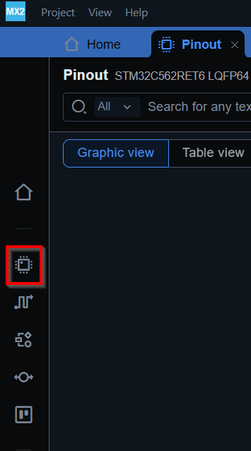
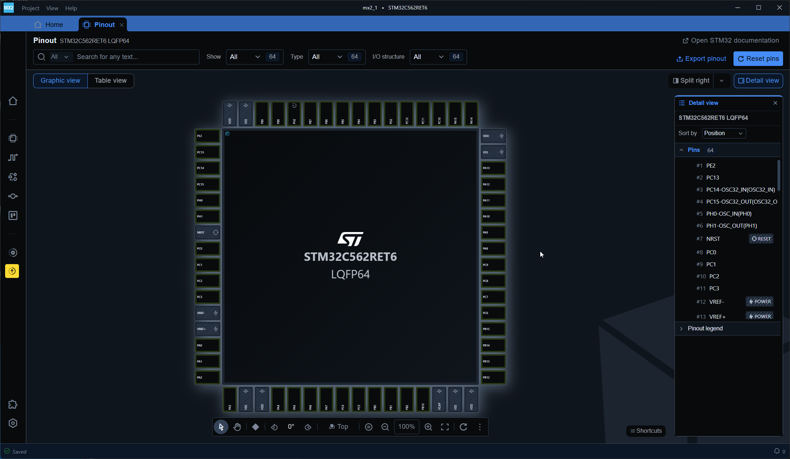
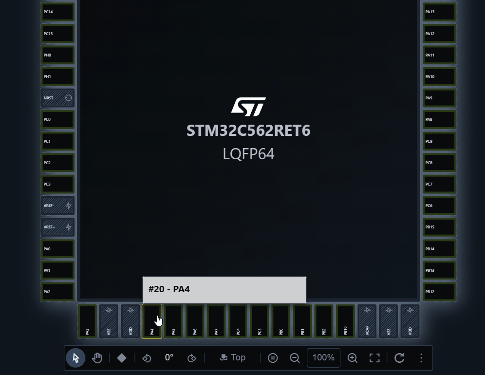
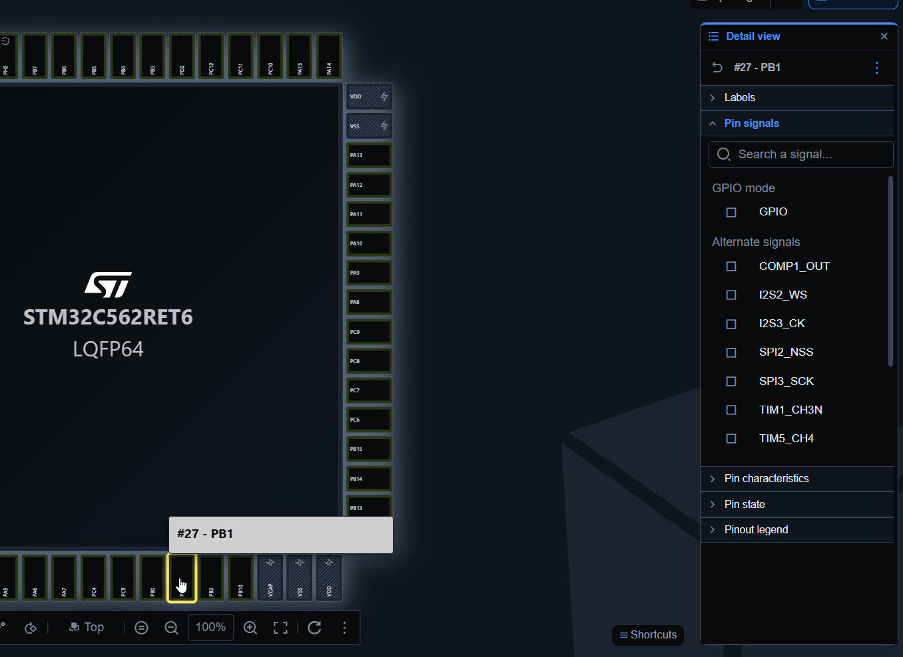
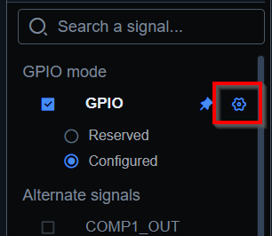

# Pinout tab

Showing package view and allow to assing pins and labels. 

# Assing GPIO pin

## From right click

1. Right click on wanted pin
2. Select assigns signal
3. Select function for pin
  - Alternate function (UART,SPI,...)
  - Or GPIO if we want to have pin as digital input/output

## From left click

1. Left click on wanted pin
2. Select assigns signal
3. Select function for pin
  - Alternate function (UART,SPI,...)
  - Or GPIO if we want to have pin as digital input/output

## Assigned pin

 If pin is assigned we can use `Configure` button to go directly to periphery configuration

 
 