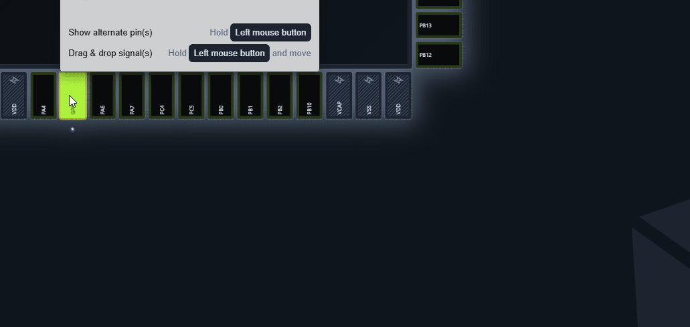
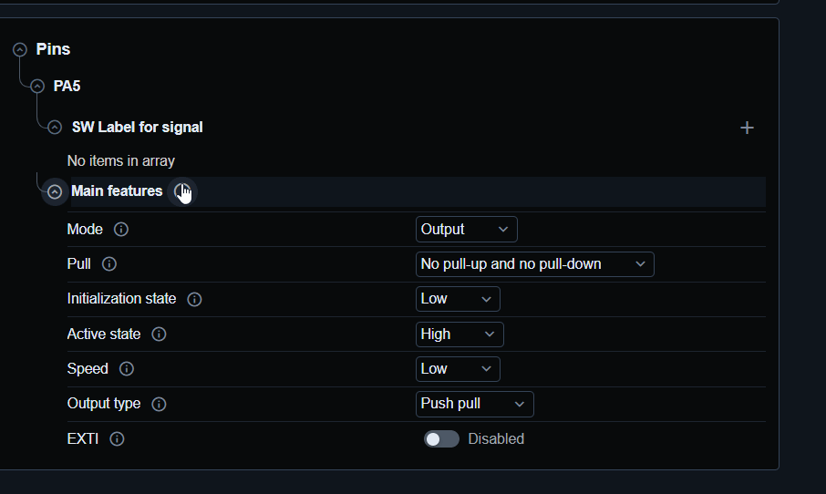
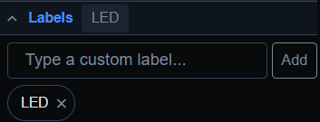

# Pin label

It is possible to assing labels for pin in 
- pinout
- in configuration

## Pinout label



1. Go to pinout view
2. Right click on pin
3. Got to edit Label
4. Create new label

You can have more than one lable on pin. 
In pinout view only first label is visible.

## configuration label



1. Got to gpio periphery configuration view
2. Open pin configuration
3. Add new lavel in `SW Label for signal`

You can have more lables for one pin/signal

## Label usage

MX will create a defines for the pins based on your label in `mx_gpio_default.h`

For example my `LED` label



Will be used as this:

```c
/* Primary aliases for GPIO PA5 pin */
#define LED_PORT                                        HAL_GPIOA
#define LED_PIN                                         HAL_GPIO_PIN_5
#define LED_INIT_STATE                                  HAL_GPIO_PIN_RESET
#define LED_ACTIVE_STATE                                HAL_GPIO_PIN_SET
#define LED_INACTIVE_STATE                              HAL_GPIO_PIN_RESET
```

In the HAL, I can use then the label to make my code more independent.  

```c
HAL_GPIO_WritePin(LED_PORT,LED_PIN,LED_ACTIVE_STATE);
```

