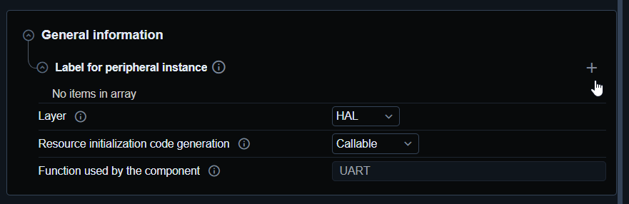

# Periphery label

It is possible to create label for periphery confoguration which can be used in user project


For any periphery confgiruation is possible to add periphery label.

1. Open periphery
2. Got to general information
3. Add your label



This will create defines for my label which i can use in my code. Defines will be in file `mx_hal_def.h`

One for init
```c
#define my_uart_init mx_usart1_uart_init
```

One for deinit
```c
#define my_uart_deinit mx_usart1_uart_deinit
```

And most important one for get handle so i can use my UART independently.
```c
#define my_uart_gethandle mx_usart1_uart_gethandle
```

Now i can use this lavel to use the uart if i keep same label i can use UART1/2/3 and i dont need to change my user code. 

```c
huart = my_uart_gethandle()
HAL_UART_Transmit(huart,buffer,size,timeout); 
```

