# hal common definitions

The HALv2 have additional features which can easy the development but they are disabled by default to save space. 

Configuration is normaly in file `stm32ABxx_hal_conf` where `AB` is the device type

To open this configuration in MX2

1. Project Settings
2. Global services part
3. Line `HAL common definitions`
4. In column `Actions` press settings button

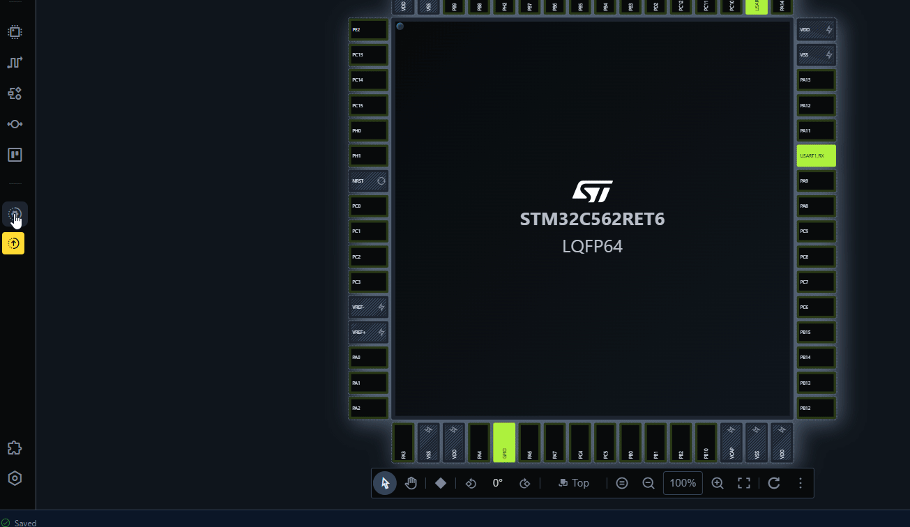

This will open HAL configuration options

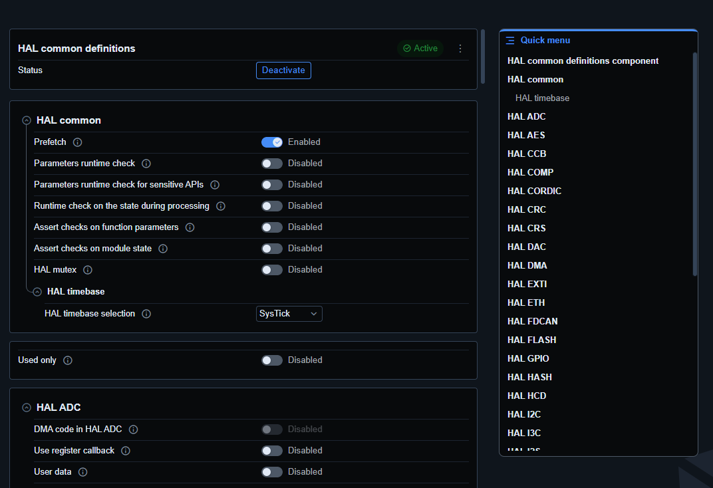

It is splitted by peripheries so is possible to tailor it to the specific application. 


## Used only

Very useful option is `Used only` to show only configuration for used peripheries

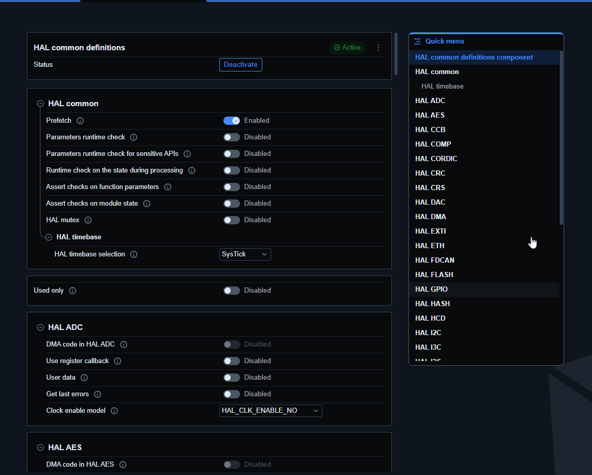

## Clock enable model

This option is automatically enable clock in config function. 
For example for GPIO

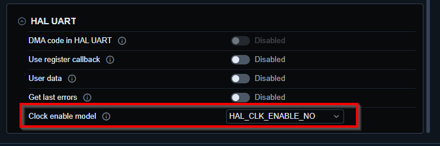

### Disabled

If disabled we need to have code where we have 
`HAL_RCC_GPIOA_EnableClock();`

```c
HAL_RCC_GPIOA_EnableClock();

  /*
    GPIO pin labels :
    PA5   ---------> LED, LED_SW_LABEL
    */
  /* Configure PA5 GPIO pin in output mode */
  gpio_config.mode            = HAL_GPIO_MODE_OUTPUT;
  gpio_config.speed           = HAL_GPIO_SPEED_FREQ_LOW;
  gpio_config.pull            = HAL_GPIO_PULL_NO;
  gpio_config.output_type     = HAL_GPIO_OUTPUT_PUSHPULL;
  gpio_config.init_state      = LED_INIT_STATE;
  if (HAL_GPIO_Init(LED_PORT, LED_PIN, &gpio_config) != HAL_OK)
  {
    return SYSTEM_PERIPHERAL_ERROR;
  }

  ```

  ### Enabled

If enabled this part is done automaticaly in ini function. It can be helpful if we want to be sure that clocks are enabled

Inside `HAL_GPIO_Init` is the clock enable.

```c
#if defined (USE_HAL_GPIO_CLK_ENABLE_MODEL) && (USE_HAL_GPIO_CLK_ENABLE_MODEL > HAL_CLK_ENABLE_NO)
  LL_AHB2_GRP1_EnableClock(GET_GPIO_CLK_ENABLE_BIT((uint32_t)gpiox));
#endif /* USE_HAL_GPIO_CLK_ENABLE_MODEL > HAL_CLK_ENABLE_NO */
```

## DMA code

Option 
`DMA code in HAL` is used to enabled uspport for DMA. It is enabled by default when DMA is enabled in the periphery. 
Keep it disabled will make the functions smaller. 

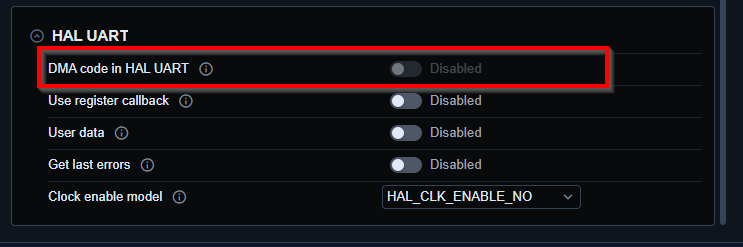

## User callack

Allow to register your own callbacks. 

For example in UART. 
If we use DMA or IT. We have access to callbacks like

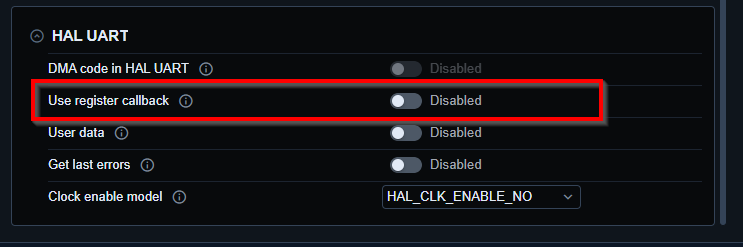

`HAL_USART_TxCpltCallback`

How ever this callback is the same in case we have three uarts like UART1/2/3.
So we need to parse which uart called the handle. Alse we cannot use it in our own files. Because we cannot have it 3x.

Solution is to enable `User callback ` option. 

Which adds function to register callbacks

```c
hal_status_t HAL_USART_RegisterTxCpltCallback(hal_usart_handle_t *husart, hal_usart_cb_t p_callback);
```

So we can have three different callback for our three uarts 


```c

HAL_USART_RegisterTxCpltCallback(husart1, myTxCallback1);
HAL_USART_RegisterTxCpltCallback(husart2, myTxCallback2);
HAL_USART_RegisterTxCpltCallback(husart3, myTxCallback3);
```

## User data

The user data allow to store values into periphery handle

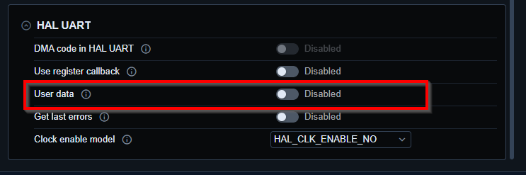

```c
void HAL_USART_SetUserData(hal_usart_handle_t *husart, const void *p_user_data);
const void *HAL_USART_GetUserData(const hal_usart_handle_t *husart);
```

This is useful in case we are calling from callback diffrent higher API. 

## error state

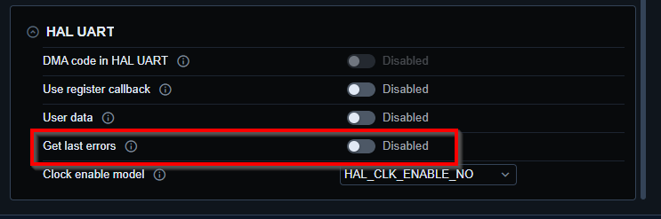

Allow to use function `GetLastErrorCodes` to get last information about the errors happen inperiphery

```c
uint32_t HAL_UART_GetLastErrorCodes(const hal_uart_handle_t *huart);
```

## Assert checks on function parameters


Will check HAL function input parameters

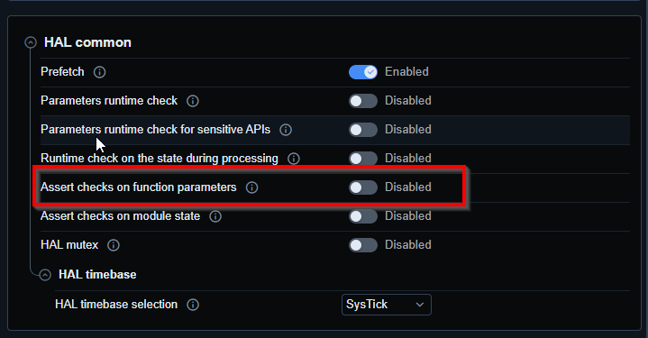

If they are not valid it will jump into `assert_dbg_param_failed` function in `mx_system.c`

```c
/**
  * @brief  Reports the name of the source file and the source line number
  *         where the ASSERT_DBG_PARAM error has occurred.
  * @param  file: pointer to the source file name
  * @param  line: ASSERT_DBG_PARAM error line source number
  * @retval None
  */
void assert_dbg_param_failed(uint8_t *file, uint32_t line)
{
  /* User can add his own implementation to report the file name and line number,
    ex: printf("Wrong parameters value: file %s on line %d\r\n", file, line) */
  /* Infinite loop */
  while (1)
  {
  }
}
```


## Timebase change

Allow to change HAL timebase. By default **Systick** is used. 

 > [!NOTE]
 > To change new clock source is necessary to enable differen periphery for example TIMx  then is allowed to sswitch HAL timebase.

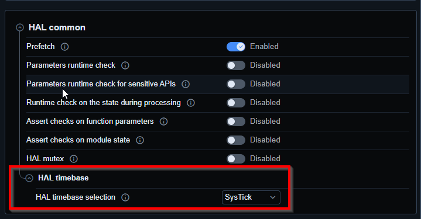


## HAL check param

Check if HAL input pointer structures are not NULL(not defined)

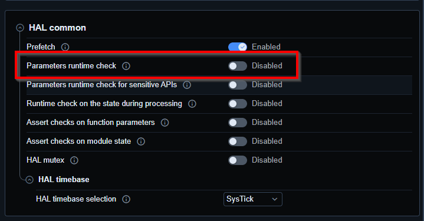

As and example in `HAL_USART_Init` it is checking the handle

```c
hal_status_t HAL_USART_Init(hal_usart_handle_t *husart, hal_usart_t instance)
{
  ASSERT_DBG_PARAM(husart != NULL);
  ASSERT_DBG_PARAM(IS_USART_INSTANCE((USART_TypeDef *)((uint32_t)instance)));

#if defined(USE_HAL_CHECK_PARAM) && (USE_HAL_CHECK_PARAM == 1)
  if (husart == NULL)
  {
    return HAL_INVALID_PARAM;
  }
#endif /* USE_HAL_CHECK_PARAM */
```

## Parameters runtime check for sensitive APIs

Similar to `HAL check param` but to secure peripherals like AES, PKA, ...

## Runtime check on the state during processing

Allow to check if the periphery is already used with API and block the second call with BUSY. 

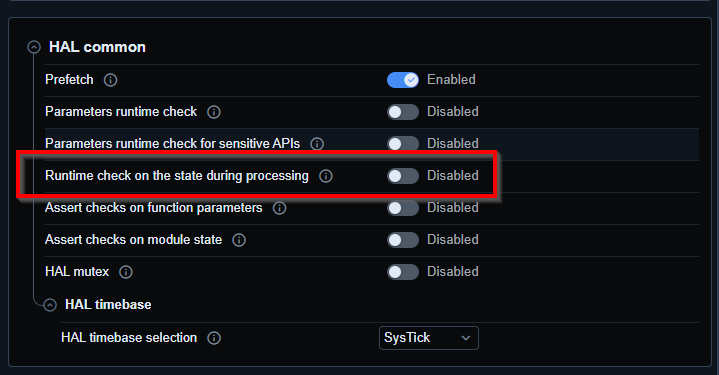

Not all API/ peripherals have this feature.

## RCC reset options

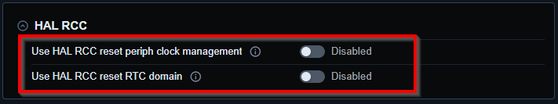

When called `HAL_RCC_Reset` the option 

### Use HAL RCC reset periph clock management

Disable periphery clock

> [!WARNING]
> It is not reseting the periphery using the forece reset bits.

### Use HAL RCC reset RTC domain
 
Reset the backup domain.